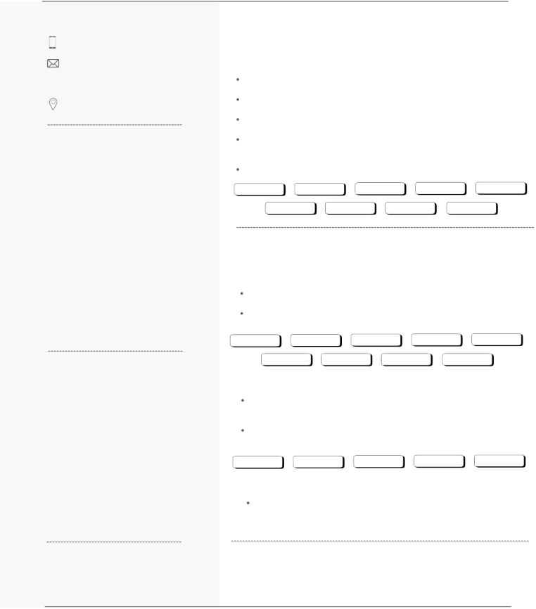

# MEET PATEL
MTECH STUDENT | SPECIALIZING AI 

Passionate MTech student specializing in Artificial Intelligence with experience in Generative AI, Deep Learning, Machine Learning and Natural Language Processing. Skilled in designing and deploying cutting-edge AI applications. Experienced in research collaborations, developing innovative solutions using transformers and large language models, and delivering end-to-end AI applications with real-world impact. 
## **CONTACT WORK EXPERIENCE**
#### +91 88665 89159 **Research Intern at DRDO (DIA-SVPCoE)**
meetnpatel101112@gmail.com July 2024  - March 2025

Conducted MTech research on “**Data Extraction from CCTV Images**” under DRDO Github LinkedIn

guidance. 

**Developed  and  deployed  (Project  1)  data  extraction  local  system**  using  vision Pune, Maharashtra

language model and large language model. 

**Awarded  India  AI  Fellowship**  for  innovative  contributions  to  AI  for  the  research project to the surveillance.

**SKILLS Developed and deployed (Project 2)** a local system for comprehensive document

understanding, including **summarization, translation and search functionalities** from a large database.

**Generative AI, LLM, Deep Learning,** Successfully completed **additional** **two projects**. 

**Machine Learning, NLP, Image**

**Processing** Llama3 Vision Models Groq Models OCR Models Vector DBs

**Frameworks and Libraries** Huggingface Langchain Fine Tuning Embedding

Huggingface, Langchain, Groq, OpenAI, PyTorch, Transformers
## **Vector Database PROJ ECTS**
FAISS, Pinecone, Chroma, Milvus,
#### PgVector **1. Conversational Chatbot (Generative AI)                [Project Link**](https://github.com/VirtulMachine01/Adv-Chatbot)**
**Agentic Frameworks** Developed a **Conversational AI chatbot** that supports text, audio, image, and PDF CrewAI, LangFlow, PhiData interactions, with seamless integration of **RAG tasks** for querying documents.

Built the **frontend with Streamlit,** **stored chat sessions** locally, and deployed the **Programming Languages** application on **Streamlit Cloud** for real-time interaction.

Python, C++, C#

FAISS Groq Llama3.3 70b Llama3.2-vision OpenAI whisper

Huggingface Sqlite Langchain Embedding
#### **EDUCATION 2. Text to SQL (Generative AI)                                     [Project Link**](https://huggingface.co/spaces/VirtualMachine01/text2query_gemini/tree/main)**
**Defence Institute of Advanced** Developed a Text-to-SQL query extractor web application using **Google Gemini Pro**, **Technology, Pune** where text input is converted into SQL queries and the output is retrieved data from

the SQLite database.

**MTech in CSE with Specialization of AI** Built the **frontend using Streamlit** and deployed the web application on **Hugging** 2023-2025 **Face Spaces** for demonstration purposes.
###### CGPA - 8.42/10
#### Gemini flash1.5 Sqlite Streamlit Huggingface Text-to-SQL **Sarvajanik College of Engineering**
#### **and Technology, Surat 3. Movie Recommendation System (NLP)                   [Project Link**](https://github.com/MiT1011/Movie_Recommender_System)**
**BE in Computer Engineering** Developed this project using **Count Vectorizer** and **Cosine Similarity**, TMDB 2019-2023 database, data preprocessing with **Pandas, Numpy, and Matplotlib**, and interactive

CGPA - 9.10/10 web application **developed with Streamlit and**  **deployed on Streamlit Cloud.**
## **LANGUAGES CERTIFICATES**
English Hindi Gujarati CrewAI Generative AI [Image & Video ](https://drive.google.com/file/d/1kX40lMmRohEQTSMSf9cJXQDY0F1KNfXR/view?usp=drive_link)Analysis

CS GATE 23 DA GATE 24 Prompt Engineering
